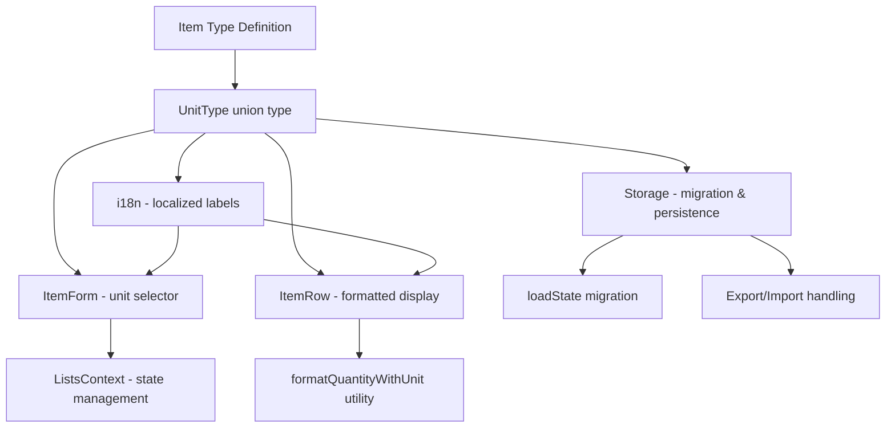

# Design Document: New Unit Types

## Overview

This feature adds an optional `unitType` field to the `Item` data model, allowing users to associate a measurement unit (kg, lb, g, liter, ml, pack, dozen, oz, or the default "unit") with each item's quantity. The unit type is purely informational and does not affect price calculations or totals. It enhances readability by displaying context like "2 kg" or "500 ml" instead of just "2" or "500".

The implementation touches the data layer (types, storage migration, import/export), UI layer (ItemForm selector, ItemRow display), and i18n layer (localized labels for both English and Brazilian Portuguese).

## Architecture

The feature follows the existing architecture patterns of the application:



The design maintains backward compatibility: existing items without a `unitType` field are silently migrated to `unitType: "unit"` on load.

## Components and Interfaces

### Type Changes

```typescript
// src/types/index.ts
export type UnitType = 'unit' | 'kg' | 'lb' | 'g' | 'liter' | 'ml' | 'pack' | 'dozen' | 'oz'

export const UNIT_TYPES: UnitType[] = ['unit', 'kg', 'lb', 'g', 'liter', 'ml', 'pack', 'dozen', 'oz']

export interface Item {
  id: string
  name: string
  quantity: number
  unitPrice: number
  unitType?: UnitType  // optional for backward compat; defaults to 'unit'
  selected: boolean
  includeInTax: boolean
  assignedTo?: string[]
}
```

### New Utility: `src/lib/unitTypes.ts`

```typescript
import type { UnitType } from '../types'
import type { Locale } from './format'

// Localized display labels for each unit type
const labels: Record<Locale, Record<UnitType, string>> = {
  'en': {
    unit: 'unit',
    kg: 'kg',
    lb: 'lb',
    g: 'g',
    liter: 'liter',
    ml: 'ml',
    pack: 'pack',
    dozen: 'dozen',
    oz: 'oz',
  },
  'pt-BR': {
    unit: 'unidade',
    kg: 'kg',
    lb: 'lb',
    g: 'g',
    liter: 'litro',
    ml: 'ml',
    pack: 'pacote',
    dozen: 'dúzia',
    oz: 'oz',
  },
}

export function getUnitLabel(unitType: UnitType, locale: Locale): string
export function getUnitTypeOptions(locale: Locale): { value: UnitType; label: string }[]
export function formatQuantityWithUnit(quantity: number, unitType: UnitType, locale: Locale): string
```

### `formatQuantityWithUnit` Logic

- If `unitType === 'unit'` and `quantity === 1`: return just the formatted quantity (e.g., `"1"`)
- Otherwise: return `"{quantity} {localizedLabel}"` (e.g., `"2 kg"`, `"500 ml"`, `"1.5 litro"`)

### ItemForm Changes

The `ItemForm` component gains a new `unitType` state variable (initialized from the edited item or defaulting to `'unit'`). A `<select>` dropdown is added in the same grid row as the quantity field, forming a visual pair:

```
┌─────────────────────────────────────┐
│  Quantity        │  Unit Type       │
│  [    1    ]     │  [ kg ▾ ]        │
└─────────────────────────────────────┘
```

The grid changes from `grid-cols-2` (quantity + unit price) to `grid-cols-3` (quantity + unit type + unit price).

### ItemRow Changes

The `ItemRow` component calls `formatQuantityWithUnit(item.quantity, item.unitType ?? 'unit', locale)` and displays the result alongside the item name or below the price.

### Storage Migration

`loadState()` in `src/lib/storage.ts` adds a migration step:

```typescript
state.lists = state.lists.map(l => ({
  ...l,
  sections: l.sections ?? [],
  items: l.items.map(item => ({
    ...item,
    unitType: item.unitType ?? 'unit',
  })),
}))
```

### Export/Import Handling

The existing JSON export already serializes all item fields. Since `unitType` is added to the `Item` interface, it will be included automatically. On import, the same migration logic applies to normalize missing fields.

### ListsContext Changes

The `duplicateItem` function already spreads all properties of the original item (`{ ...original, id: newId, ... }`). Since `unitType` is a field on the item, it is preserved automatically. No changes are needed to the context for duplication.

The `addItem` function accepts `Omit<Item, 'id'>` which will now include `unitType`. The `ItemForm` is responsible for always providing a `unitType` value.

### Calculations (No Changes)

`calcTotals` and `calcSplit` in `src/lib/calculations.ts` compute `item.quantity * item.unitPrice`. The `unitType` field is not referenced in any calculation, so no changes are needed. This is by design — unit types are informational only.

## Data Models

### Updated Item Model

| Field | Type | Required | Default | Description |
|-------|------|----------|---------|-------------|
| id | string | yes | UUID | Unique identifier |
| name | string | yes | — | Item display name |
| quantity | number | yes | 1 | Numeric quantity |
| unitPrice | number | yes | 0 | Price per unit |
| unitType | UnitType | no | 'unit' | Measurement unit label |
| selected | boolean | yes | false | Checked/purchased state |
| includeInTax | boolean | yes | true | Whether item is taxable |
| assignedTo | string[] | no | [] | Person IDs for bill split |

### UnitType Enum Values

| Value | English Label | Portuguese Label |
|-------|--------------|-----------------|
| unit | unit | unidade |
| kg | kg | kg |
| lb | lb | lb |
| g | g | g |
| liter | liter | litro |
| ml | ml | ml |
| pack | pack | pacote |
| dozen | dozen | dúzia |
| oz | oz | oz |

### LocalStorage Schema (unchanged key, extended item shape)

```json
{
  "lists": [
    {
      "id": "...",
      "items": [
        {
          "id": "...",
          "name": "Milk",
          "quantity": 2,
          "unitPrice": 3.50,
          "unitType": "liter",
          "selected": false,
          "includeInTax": true
        }
      ]
    }
  ]
}
```

## Correctness Properties

*A property is a characteristic or behavior that should hold true across all valid executions of a system — essentially, a formal statement about what the system should do. Properties serve as the bridge between human-readable specifications and machine-verifiable correctness guarantees.*

### Property 1: Default unitType normalization

*For any* item object that lacks a `unitType` field (or has `unitType` undefined), when processed by the system's normalization logic (load from storage, import, or creation without explicit selection), the resulting item SHALL have `unitType` equal to `"unit"`.

**Validates: Requirements 1.2, 1.3, 4.1, 4.3**

### Property 2: UnitType preservation on duplication

*For any* item with any valid `unitType` value, when that item is duplicated, the resulting duplicate item SHALL have the same `unitType` as the original.

**Validates: Requirements 1.4**

### Property 3: UnitType round-trip persistence

*For any* item with a valid `unitType`, serializing the item to JSON (for storage or export) and then deserializing it back SHALL produce an item with the same `unitType` value.

**Validates: Requirements 4.2, 4.4**

### Property 4: Display formatting for unit types

*For any* item with `unitType` != `"unit"` and any positive quantity, `formatQuantityWithUnit` SHALL return a string containing both the formatted quantity and the localized unit abbreviation. Additionally, when `unitType` == `"unit"` and `quantity` == 1, the function SHALL return only the quantity without a unit suffix.

**Validates: Requirements 3.1, 3.2, 3.3**

### Property 5: Locale-aware unit labels

*For any* valid `UnitType` value and any supported locale (`"en"` or `"pt-BR"`), `getUnitLabel` SHALL return a non-empty string that matches the defined localization table for that locale and unit type.

**Validates: Requirements 5.2, 5.3**

### Property 6: UnitType does not affect calculations

*For any* list of items, changing the `unitType` of any or all items (while keeping quantity and unitPrice unchanged) SHALL NOT change the output of `calcTotals` or `calcSplit`.

**Validates: Requirements 6.1, 6.2, 6.3**

### Property 7: Form pre-selects current unitType on edit

*For any* item with a valid `unitType`, when the ItemForm is rendered in edit mode with that item, the unit type selector's initial value SHALL equal the item's `unitType`.

**Validates: Requirements 2.2**

### Property 8: Form submit includes selected unitType

*For any* unit type selection made in the ItemForm, the submitted item data SHALL include the selected `unitType` value.

**Validates: Requirements 2.4**

## Error Handling

| Scenario | Handling Strategy |
|----------|-------------------|
| Item loaded from storage with invalid `unitType` value | Normalize to `"unit"` during migration |
| Item loaded from storage without `unitType` field | Normalize to `"unit"` during migration |
| Imported JSON with unknown `unitType` string | Normalize to `"unit"` during import validation |
| LocalStorage quota exceeded when saving | Existing silent failure behavior (no change) |
| `formatQuantityWithUnit` called with quantity ≤ 0 | Return formatted quantity without unit (graceful) |

The existing error handling patterns in `loadState()` (try/catch returning default state) and `saveState()` (silent catch) remain unchanged. The migration logic is additive and cannot corrupt existing data.

## Testing Strategy

### Unit Tests (Example-Based)

- **ItemForm rendering**: Verify the unit type selector appears with all 9 options in add mode (Req 2.1)
- **ItemForm layout**: Verify selector is adjacent to quantity field (Req 2.3)
- **ItemForm localization**: Verify labels render in correct locale (Req 5.4)
- **Smoke test**: Verify `UNIT_TYPES` array contains exactly 9 expected values (Req 1.1)
- **Smoke test**: Verify both locale label maps contain entries for all unit types (Req 5.1)

### Property-Based Tests (via `fast-check`)

The project uses Vitest as its test runner. Property-based tests will use the `fast-check` library integrated with Vitest.

Each property test MUST:
- Run a minimum of 100 iterations
- Reference the corresponding design property in a tag comment
- Use `fast-check` arbitraries to generate random items, unit types, and quantities

**Property tests to implement:**

1. **Feature: new-unit-types, Property 1: Default unitType normalization** — Generate random item-like objects without `unitType`, pass through normalization, assert `unitType === 'unit'`.
2. **Feature: new-unit-types, Property 2: UnitType preservation on duplication** — Generate random items with random unitType, run duplication logic, assert unitType matches.
3. **Feature: new-unit-types, Property 3: UnitType round-trip persistence** — Generate random items, serialize to JSON, deserialize, assert unitType preserved.
4. **Feature: new-unit-types, Property 4: Display formatting for unit types** — Generate random (quantity, unitType, locale) tuples, assert format string contains expected components.
5. **Feature: new-unit-types, Property 5: Locale-aware unit labels** — For all combinations of unitType and locale, assert non-empty string matching lookup table.
6. **Feature: new-unit-types, Property 6: UnitType does not affect calculations** — Generate random lists, compute totals, change all unitTypes randomly, recompute, assert equal.
7. **Feature: new-unit-types, Property 7: Form pre-selects current unitType on edit** — Generate items with random unitType, render ItemForm, assert selector value.
8. **Feature: new-unit-types, Property 8: Form submit includes selected unitType** — Generate random unitType selections, simulate submit, assert callback receives it.

### Integration Tests

- End-to-end flow: create item with unit type → verify storage → reload → verify persistence
- Migration: load old-format data (no unitType) → verify items display correctly
- Export/import cycle: export list → remove unitType from JSON → import → verify defaults applied
